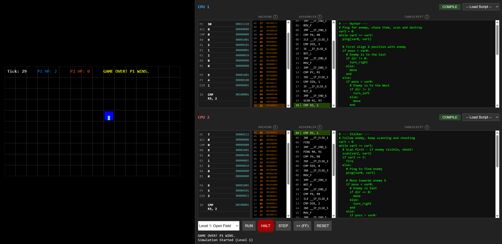

# CPU Wars

**CPU Wars** is an educational puzzle-strategy game where players write "Fake Assembly" code to control tanks in a real-time autobattler. It teaches low-level programming concepts like registers, loops, conditionals, and memory management in a visual, engaging way.



<https://tomcoolpxl.github.io/cpu-wars/>

## How to Play

1. **Code Phase:** Write "TankScript" code in the editor. Control your tank's movement, sensors (`scan`, `ping`), and weapons (`fire`).
2. **Compile:** Your high-level code is compiled into assembly-like instructions (e.g., `MOV_F`, `JMP`, `SCAN`).
3. **Battle:** Hit **RUN**. Your code executes on a custom Virtual Machine (VM) against an opponent.
4. **Win:** Destroy the enemy tank (3 hits) to win the round.

### Example TankScript

```python
# Simple Scout - Move and Fire
loop:
  scan(var0, var1)   # Scan ahead for enemies

  if var1 == 2:      # 2 = Enemy detected
    fire
  else:
    if var1 == 1:    # 1 = Wall ahead
      turn_right
    else:
      move           # Clear path
    end
  end
end
```

## Getting Started

### Prerequisites

* Node.js (v18+ recommended)
* npm

### Installation

```bash
git clone https://github.com/tomcoolpxl/assembly-tanks.git
cd assembly-tanks
npm install
```

### Running Locally

```bash
npm run dev
```

Open `http://localhost:5173` (or the port shown in your terminal).

### Running Tests

The core logic (VM, Compiler, Simulation) is strictly separated from the visualization and covered by tests.

```bash
npm test
```

## Project Architecture

The project is built with a strict separation of concerns:

* **`src/vm/`**: The "brain". Contains the `CPU`, `Compiler`, `Tokenizer`, and `Parser`. **Zero external dependencies.**
* **`src/simulation/`**: The "referee". manages the `Grid`, collision detection, and turn resolution. **Zero Phaser dependencies.**
* **`src/view/`**: The "eyes". Uses **Phaser 3** to render the state provided by the simulation.

### Key Concepts

* **Registers:** `var0`-`var5` (General), `posx`/`posy`/`dir` (Read-only).
* **Constraints:**
  * **Max Ops:** 50 instructions per tick (prevents infinite loops freezing the browser).
  * **Max Nesting:** 3 levels deep for `if`/`while`/`repeat`.
  * **Strict Variable Access:** Only `var0`-`var5` are allowed.

## Deployment

The project is configured for automatic deployment to GitHub Pages via GitHub Actions.

1. Push to `main`.
2. The workflow builds the project.
3. The `dist/` folder is deployed to the `gh-pages` branch.

**Manual Deployment:**

```bash
npm run deploy
```

## Documentation

* **[CLAUDE.md](CLAUDE.md):** Developer reference for AI assistants and contributors.
